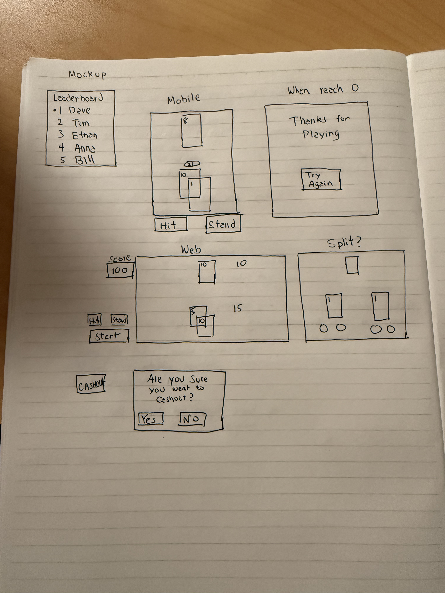

Gamified Blackjack Simulator

Game Overview

This is an interactive Blackjack game built directly into my portfolio. Everyone starts with 100 points. Winning a hand adds 20 points, and losing a hand subtracts 20 points. Players can choose to hit or stay, with double down or split still being considered. At any point, they can cash out to save their score and name to a shared leaderboard. The game resets when players either cash out or reach zero points, ready to be played again.

The Vision

The game makes the portfolio more interactive and enjoyable, giving visitors a reason to engage and explore. The leaderboard adds a light competitive element that encourages repeat play. It also reflects my personal interest in card games and Blackjack, which makes the experience feel genuine and fun.

Examples & Inspiration

The design and feel of this game are inspired by stake card Blackjack games and real-life casinos. I looked at traditional casino tables for layout, clarity, and game flow, and drew inspiration from high-score systems to add a sense of competition and replayability.

Resources & Tools

I plan to use JavaScript or React for the game logic and interface. CSS and Framer Motion will create smooth, interactive animations, like cards being dealt or buttons glowing when active. Figma will help plan and refine the visual layout before building, so the game feels clean and easy to use.

Fears, Uncertainties, & Doubts

One concern is making sure the game works correctly, even in unusual situations. For example, when a player reaches zero points, tries to cash out with a low score, or enters unexpected inputs. I also need to prevent inappropriate names or people trying to manipulate the leaderboard. The card outcomes should feel fair and random, like a real Blackjack game. Finally, making the game rules, animations, and point tracking work together smoothly will require careful attention.

